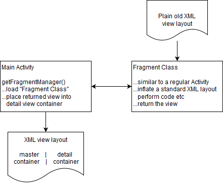

# phone-tablet-master-detail
This is a basic example of using a Fragment to achieve a master-detail type layout on tablets

The fragment is included using the diagram above. Tablets are detected by using two layout files:

/res/layout/activity_main.xml (phone layout)
/res/layout-sw600dp-land/activity_main.xml (tablet layout)

In the MainActivity class, a tablet can be detected by checking if a view in the xml exists and either starting the activity (phones) or include the Fragment (tablets)

        // check if in dual view mode (fragment exists)
        if (findViewById(R.id.fragmentLayout) == null) {
            // standard phone display
            Intent i = new Intent(this, DetailActivity.class);
            this.startActivity(i);
        } else {
            // horisontal tablet mode
            getFragmentManager()
                    .beginTransaction()
                    .replace(R.id.fragmentLayout, new DetailFragment()) // .replace or .add
                    .commit();
        }
